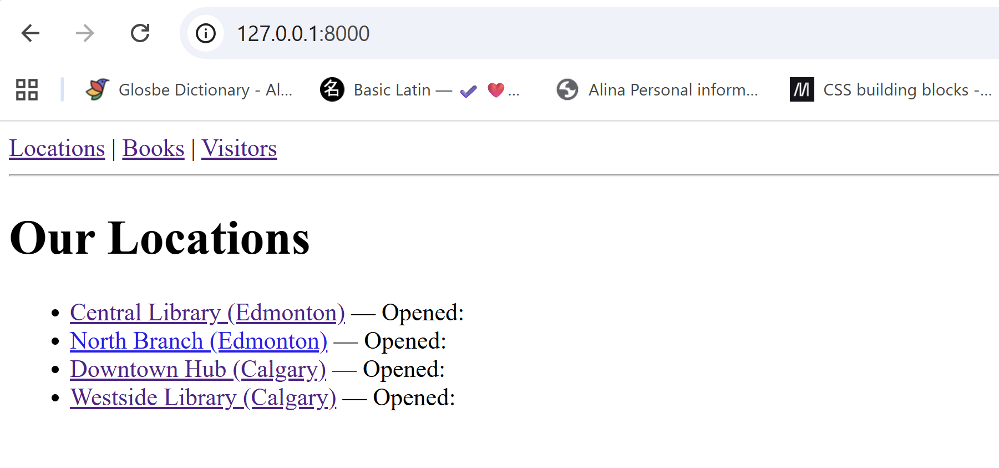
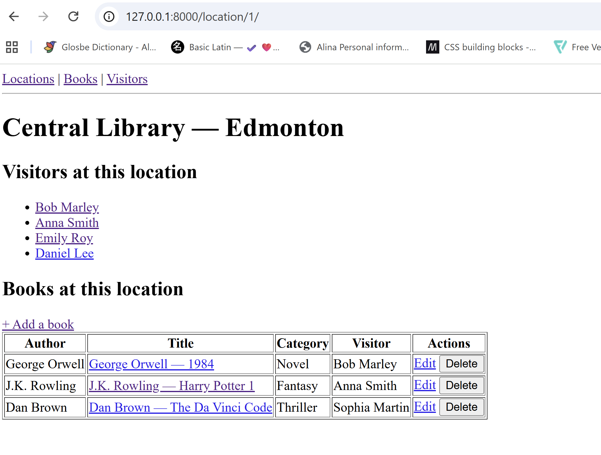
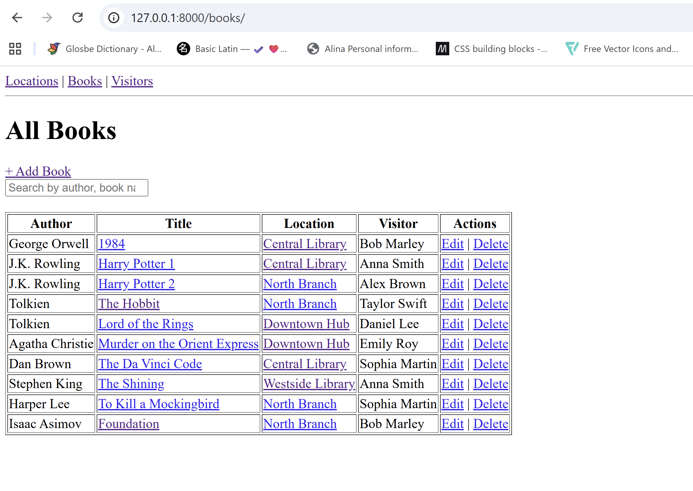
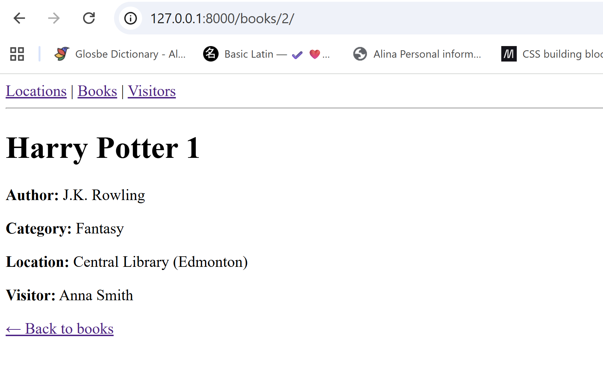
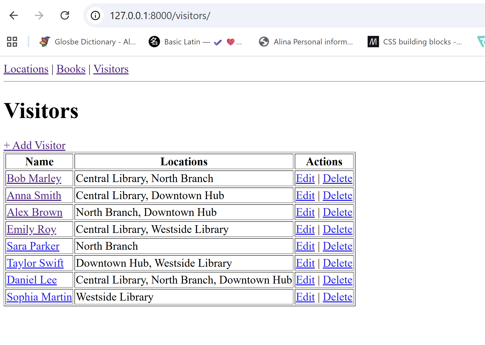
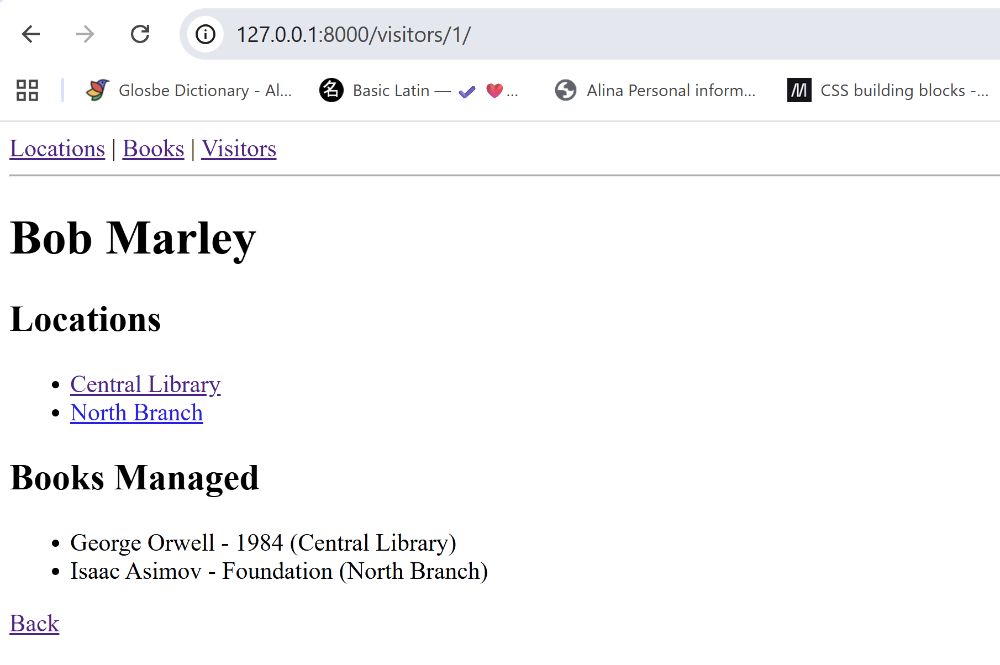

# Django + HTMX
## CRUD Operations & Search with Class-Based Views
### Library Project Tutorial

---

## 1. Overview & What You'll Build

In this tutorial you will build a web application for a library that has 4 locations. Each location lists books and the visitors who are borrowing books. You will practise the core skills every Django developer needs: connecting models with foreign keys, writing class-based views, and making pages feel dynamic with HTMX — all without writing a single line of custom CSS.

### What you will learn

- How to design models connected by `ForeignKey` and `ManyToManyField`
- How Django's ORM lets views pull data from multiple related models
- How to use Django's built-in generic class-based views (`ListView`, `DetailView`, `CreateView`, `UpdateView`, `DeleteView`)
- How to add HTMX so pages update without a full reload
- How to build live search and inline CRUD entirely in Django templates

---

## 2. Project Setup

### Step-by-step setup

**1. Create and activate a virtual environment**

```bash
# Windows
python -m venv venv
venv\Scripts\activate

# macOS / Linux
python -m venv venv
source venv/bin/activate
```

**2. Install Django**

```bash
pip install django
```

**3. Create the project and app**

```bash
django-admin startproject library .
python manage.py startapp collection
```

**4. Register the app in settings.py**

```python
INSTALLED_APPS = [
    # ... Django built-ins ...
    'collection',
]
```

> 💡 No external libraries needed for HTMX — we load it from a CDN in the base template.

---

## 3. Models

We keep every model minimal on purpose. The goal is to show different Django field types and how models connect to each other — not to build an exhaustive database schema.


### models.py

```python
from django.db import models

class Location(models.Model):
    name = models.CharField(max_length=100)
    city = models.CharField(max_length=100)

    def __str__(self):
        return f"{self.name} ({self.city})"

class Visitor(models.Model):
    first_name = models.CharField(max_length=100)
    last_name = models.CharField(max_length=100)
    # ManyToManyField: a visitor can go to multiple locations
    locations = models.ManyToManyField(
        Location,
        related_name="visitors",
    )

    def __str__(self):
        return f"{self.first_name} {self.last_name}"

class Book(models.Model):
    CATEGORY_CHOICES = [
        ("fantasy", "Fantasy"),
        ("thriller", "Thriller"),
        ("detective", "Detective"),
        ("novel", "Novel"),
        ('other', 'Other'),
    ]

    author = models.CharField(max_length=100)
    title = models.CharField(max_length=100)
    category = models.CharField(
        max_length=10,
        choices=CATEGORY_CHOICES,
        default="other",
    )
    # ForeignKey: each book belongs to one location
    location = models.ForeignKey(
        Location,
        on_delete=models.CASCADE,
        related_name="books",  # location.books.all()
    )
    # ForeignKey: each book is managed by one visitor
    visitor = models.ForeignKey(
        Visitor,
        on_delete=models.SET_NULL,
        null=True,
        related_name="books",  # visitor.books.all()
    )

    def __str__(self):
        return f"{self.author} — {self.title} ({self.category})"
```

### Model relationship diagram

```
One Location has many Books     (ForeignKey on Book)
One Visitor  has many Books     (ForeignKey on Book)
One Visitor  can go to many Locations  (ManyToManyField)
One Location has many Visitors  (reverse of ManyToManyField)
```

### Create and apply migrations

```bash
python manage.py makemigrations
python manage.py migrate
```

### Seed data (optional but recommended)

```bash
python manage.py seed
```

---

## 4. Forms

```python
from django import forms
from .models import Book, Visitor

class BookForm(forms.ModelForm):
    class Meta:
        model = Book
        fields = [
            'author',
            'title',
            'category',
            'location',
            'visitor'
        ]

class VisitorForm(forms.ModelForm):
    class Meta:
        model = Visitor
        fields = [
            'first_name',
            'last_name',
            'locations' 
        ]
```

> 💡 `ModelForm` automatically creates the right HTML input for each field type — a dropdown for `ForeignKey`, a multi-select for `ManyToManyField`, etc.

---

## 5. Views

Class-based views (CBVs) give you full CRUD with very little code. We also add a search view that returns only a partial HTML fragment — that partial is what HTMX swaps into the page.

```python
from django.views.generic import (
    ListView, DetailView, CreateView, UpdateView, DeleteView
)
from django.urls import reverse_lazy
from django.db.models import Q
from django.http import HttpResponse
from .models import Location, Visitor, Book
from .forms  import BookForm, VisitorForm


# ── Locations ───────────────────────────────────────────────────────────────
class LocationListView(ListView):
    model               = Location
    template_name       = 'collection/location_list.html'
    context_object_name = 'locations'

class LocationDetailView(DetailView):
    model               = Location
    template_name       = 'collection/location_detail.html'
    context_object_name = 'location'

    # 🔑 KEY CONCEPT: add extra context from related models
    def get_context_data(self, **kwargs):
        ctx = super().get_context_data(**kwargs)
        # location.books uses the related_name we set on Book.location
        ctx['books']    = self.object.books.all().select_related('visitor')
        ctx['visitors'] = self.object.visitors.all()
        return ctx

# ── Books ───────────────────────────────────────────────────────────────────
class BookListView(ListView):
    model               = Book
    template_name       = 'collection/book_list.html'
    context_object_name = 'books'
    # Eager-load location and visitor to avoid N+1 queries
    queryset            = Book.objects.select_related('location', 'visitor')

class BookCreateView(CreateView):
    model         = Book
    form_class    = BookForm
    template_name = 'collection/book_form.html'
    success_url   = reverse_lazy('book-list')

class BookUpdateView(UpdateView):
    model         = Book
    form_class    = BookForm
    template_name = 'collection/book_form.html'
    success_url   = reverse_lazy('book-list')

class BookDeleteView(DeleteView):
    model         = Book
    template_name = 'collection/book_confirm_delete.html'
    success_url   = reverse_lazy('book-list')

class BookDetailView(DetailView):
    model = Book
    template_name = 'collection/book_detail.html'
    context_object_name = 'book'

# ── HTMX: live search (returns a partial HTML fragment) ────────────────────
class BookSearchView(ListView):
    model               = Book
    # Returns a partial template, not a full page
    template_name       = 'collection/partials/book_table.html'
    context_object_name = 'books'

    def get_queryset(self):
        q = self.request.GET.get('q', '')
        qs = Book.objects.select_related('location', 'visitor')
        if q:
            qs = qs.filter(
                Q(author__icontains=q)  |
                Q(title__icontains=q) |
                Q(location__name__icontains=q)
            )
        return qs
    
# ── Visitors ────────────────────────────────────────────────────────────────
class VisitorListView(ListView):
    model               = Visitor
    template_name       = 'collection/visitor_list.html'
    context_object_name = 'visitors'
    queryset            = Visitor.objects.prefetch_related('locations')

class VisitorDetailView(DetailView):
    model               = Visitor
    template_name       = 'collection/visitor_detail.html'
    context_object_name = 'visitor'

    def get_context_data(self, **kwargs):
        ctx = super().get_context_data(**kwargs)
        ctx['books'] = self.object.books.select_related('location', 'visitor')
        return ctx

class VisitorCreateView(CreateView):
    model         = Visitor
    form_class    = VisitorForm
    template_name = 'collection/visitor_form.html'
    success_url   = reverse_lazy('visitor-list')

class VisitorUpdateView(UpdateView):
    model         = Visitor
    form_class    = VisitorForm
    template_name = 'collection/visitor_form.html'
    success_url   = reverse_lazy('visitor-list')

class VisitorDeleteView(DeleteView):
    model         = Visitor
    template_name = 'collection/visitor_confirm_delete.html'
    success_url   = reverse_lazy('visitor-list')

# ── HTMX: inline delete returns empty 200 so HTMX removes the row ──────────
class BookInlineDeleteView(DeleteView):
    model = Book
    http_method_names = ["post"]

    def form_valid(self, form):
        self.object.delete()
        # Return empty response — HTMX replaces the deleted row with nothing
        return HttpResponse('')
```

---

## 6. URL Configuration

### collection/urls.py

```python
from django.urls import path
from . import views

urlpatterns = [
    # Locations
    path('',                              views.LocationListView.as_view(),     name='location-list'),
    path('location/<int:pk>/',            views.LocationDetailView.as_view(),   name='location-detail'),

    # Books
    path('books/',                        views.BookListView.as_view(),         name='book-list'),
    path('books/<int:pk>/',               views.BookDetailView.as_view(),       name='book-detail'),
    path('book/add/',                     views.BookCreateView.as_view(),       name='book-create'),
    path('books/<int:pk>/edit/',          views.BookUpdateView.as_view(),       name='book-update'),
    path('books/<int:pk>/delete/',        views.BookDeleteView.as_view(),       name='book-delete'),
    path('books/<int:pk>/inline-delete/', views.BookInlineDeleteView.as_view(), name='book-inline-delete'),
    path('books/search/',                 views.BookSearchView.as_view(),       name='book-search'),

    # Visitors
    path('visitors/',                     views.VisitorListView.as_view(),      name='visitor-list'),
    path('visitors/<int:pk>/',            views.VisitorDetailView.as_view(),    name='visitor-detail'),
    path('visitors/add/',                 views.VisitorCreateView.as_view(),    name='visitor-create'),
    path('visitors/<int:pk>/edit/',       views.VisitorUpdateView.as_view(),    name='visitor-update'),
    path('visitors/<int:pk>/delete/',     views.VisitorDeleteView.as_view(),    name='visitor-delete'),
]
```

### library/urls.py

```python
from django.contrib import admin
from django.urls import path, include

urlpatterns = [
    path('admin/', admin.site.urls),
    path('', include('collection.urls')),
]
```

---

## 7. Templates

All templates use plain HTML with no custom CSS. HTMX is loaded from a CDN in the base template.

### base.html

```html
<!DOCTYPE html>
<html lang="en">
<head>
  <meta charset="UTF-8">
  <meta name="viewport" content="width=device-width, initial-scale=1">
  <title>Library</title>
</head>
<!-- hx-headers sends the CSRF token with every HTMX request -->
<body hx-headers='{"X-CSRFToken": "{{ csrf_token }}"}'>
  <nav>
    <a href="">Locations</a> |
    <a href="">Books</a> |
    <a href="">Visitors</a>
  </nav>
  <hr>
  <main>
    
  </main>
  <script src="https://unpkg.com/htmx.org@1.9.10"></script>
</body>
</html>
```

---

## 8. HTMX — How It Works

HTMX lets any HTML element make HTTP requests and swap the response into the page using HTML attributes — no JavaScript required.

### HTMX attributes

| Attribute    | What it does                        | Example value               |
|--------------|-------------------------------------|-----------------------------|
| `hx-get`     | Make a GET request                  | `/books/search/`            |
| `hx-delete`  | Make a DELETE request               | `/books/5/inline-delete/`   |
| `hx-trigger` | When to fire the request            | `keyup changed delay:300ms` |
| `hx-target`  | CSS selector of element to update   | `#book-results`             |
| `hx-swap`    | How to replace the target           | `innerHTML` / `outerHTML`   |
| `hx-confirm` | Browser confirmation dialog         | `Delete this book?`         |
| `hx-headers` | Extra HTTP headers on every request | `{"X-CSRFToken": "..."}`    |

### CSRF token fix

```html
<body hx-headers='{"X-CSRFToken": "{{ csrf_token }}"}'>
```

---

## 9. Key Concepts

### ForeignKey vs ManyToManyField

| Concept        | ForeignKey                        | ManyToManyField                   |
|----------------|-----------------------------------|-----------------------------------|
| Relationship   | Many-to-one                       | Many-to-many                      |
| Example        | Many books belong to one location | Visitors go to many locations     |
| DB storage     | Column in child table             | Separate join table               |
| Access forward | `book.location`                   | `visitor.locations.all()`         |
| Access reverse | `location.books.all()`            | `location.visitors.all()`         |

---

## 10. Running the Project

```bash
python manage.py runserver
```

Visit `http://127.0.0.1:8000/` in your browser.

## 📸 Preview

### Locations List


### Location Card


### Books List


### Book Card


### Visitors/Users List


### Visitor/User Card
